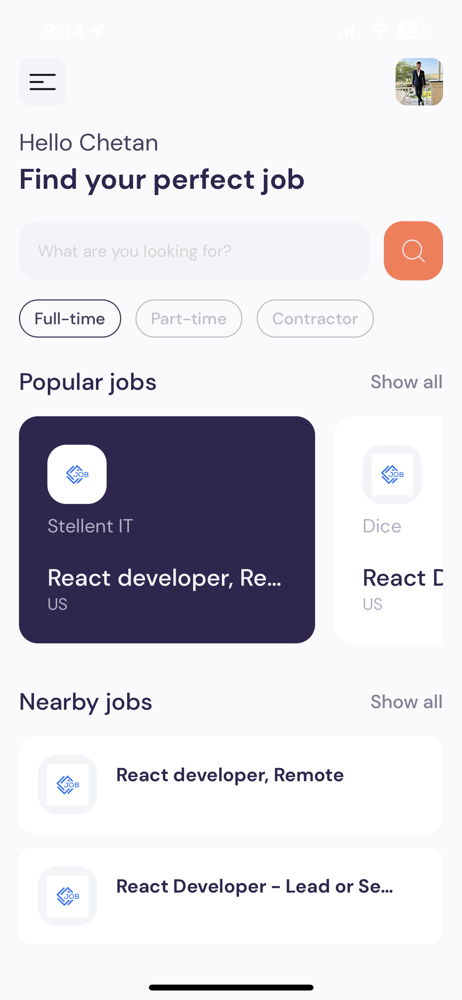
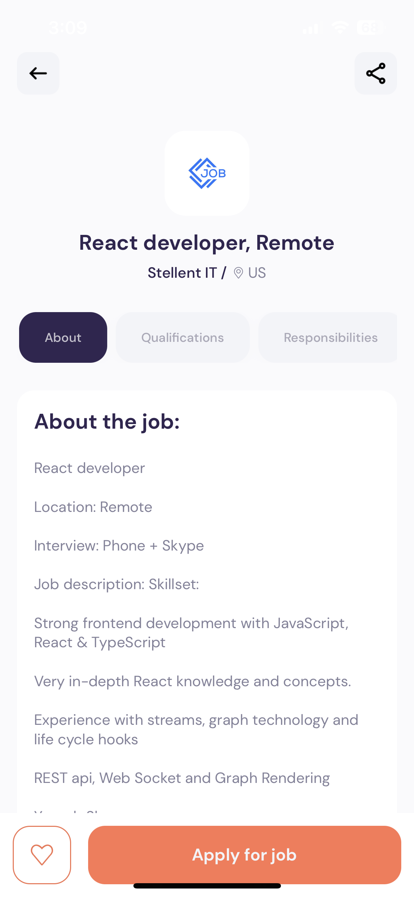
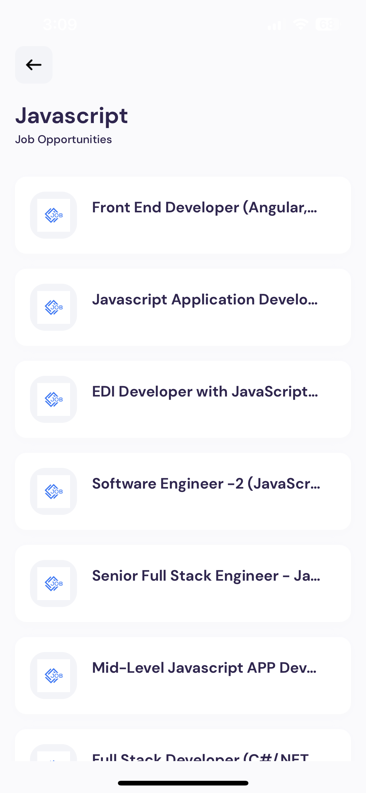

# Job Finder

> This is First App I have build using Expo \
> First Small Step Towards Cross Platform developement 🚀

## Key Functionality

- Job Search Functionality
- Job Details Page
- Ability To Apply
- Dynamic job Pages
- Pagination
- Filters

## Screenshots

Include some screenshots or demo images of your app to showcase its interface and features. You can add images to your repository and link them here.

> Home Screen

> Job Detail Screen

> Search Scren

## Installation and Getting Started

- Clone The Repo using git clone
- run npm install or yarn command to install necessary dependencies
- run application using npm start or using expo-cli
